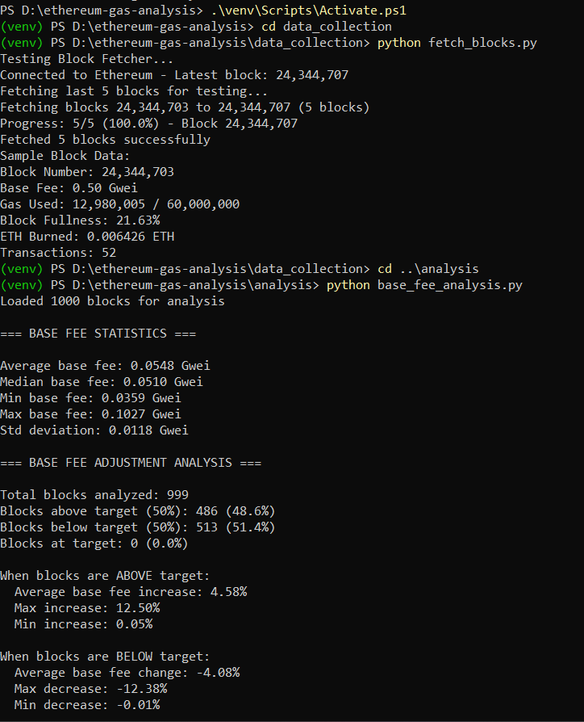
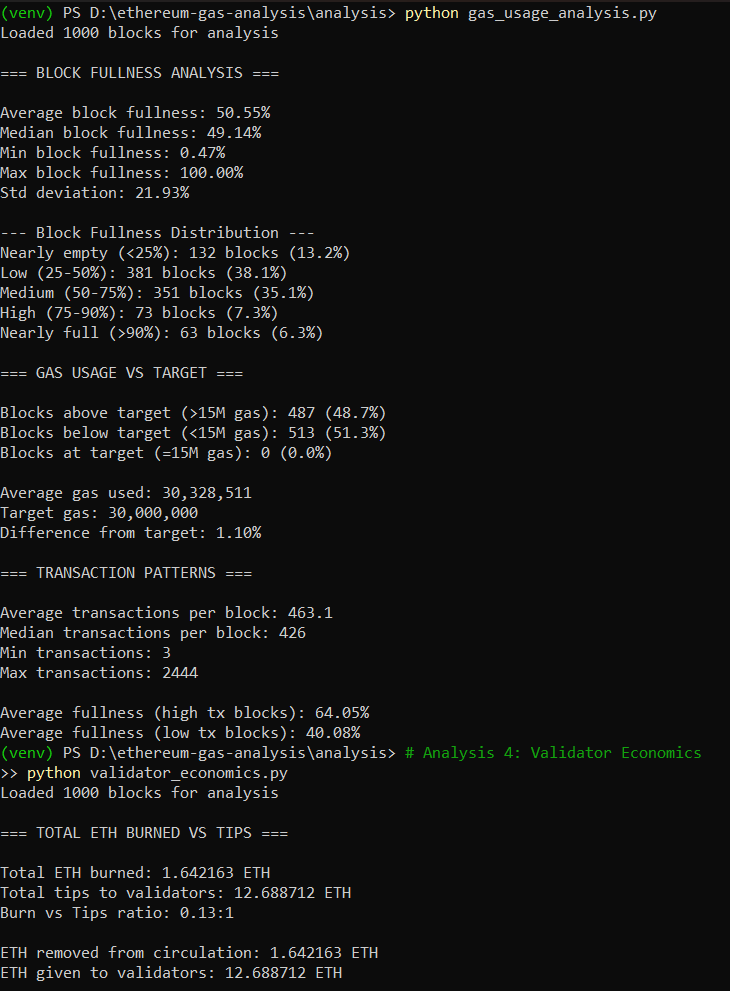
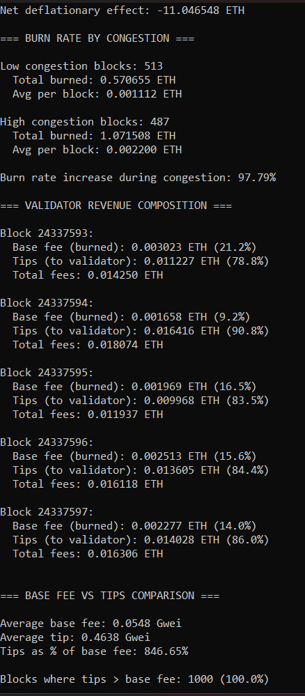
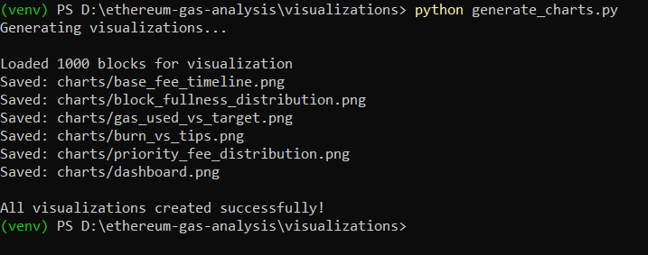
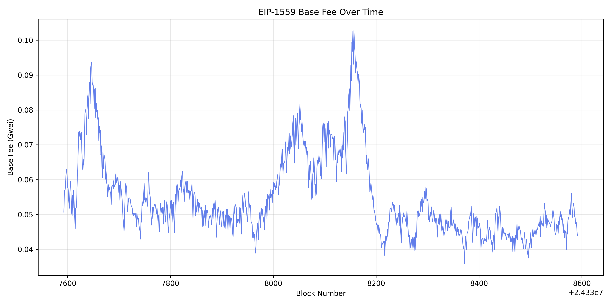
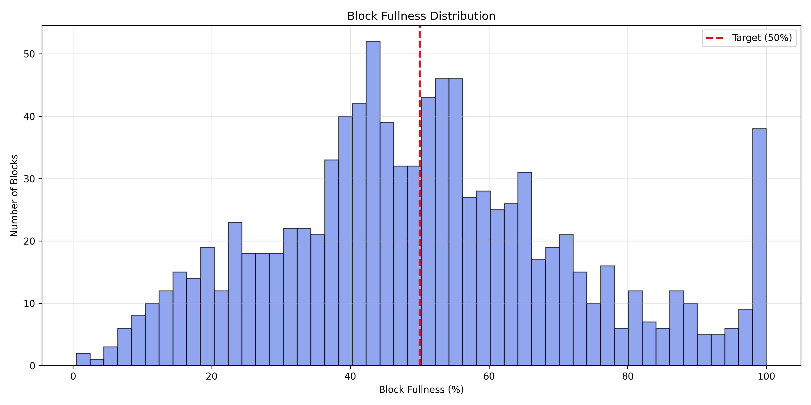
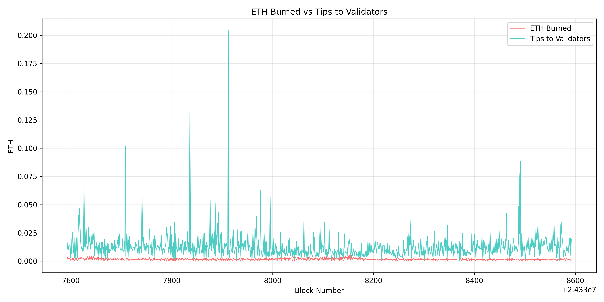
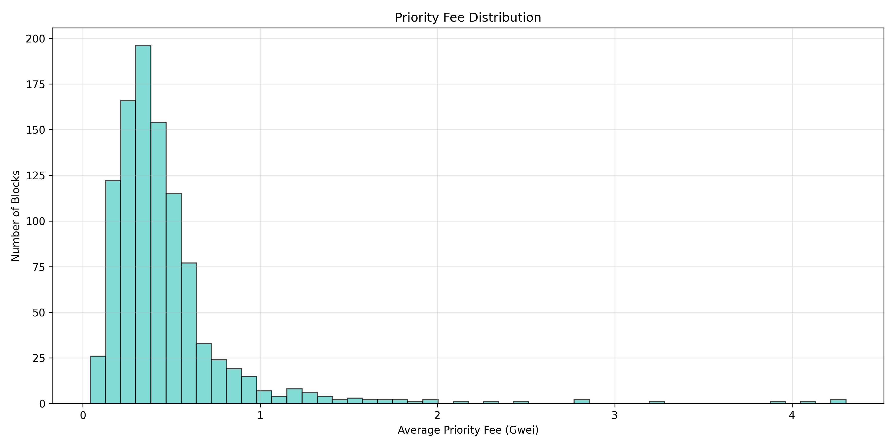
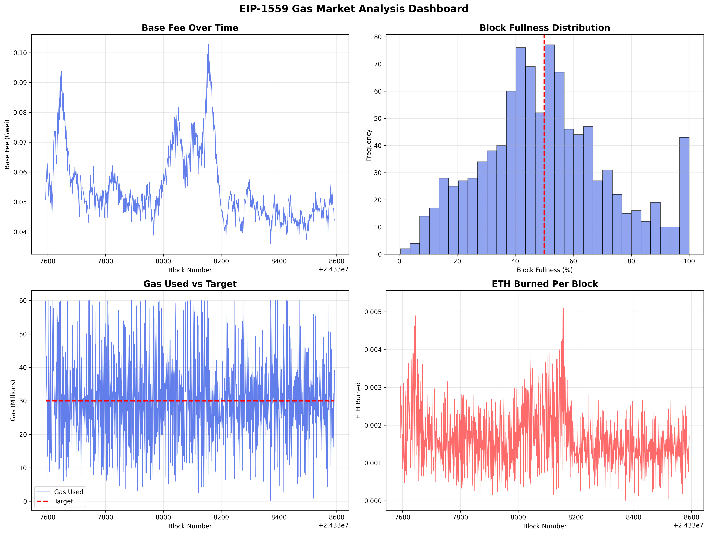

# Ethereum Gas Market & Fee Mechanism Analysis (EIP-1559)

A comprehensive analysis of Ethereum's EIP-1559 fee market using real blockchain data to study base fee adjustment behavior, gas usage patterns, priority fee dynamics, and validator economics.

## 🎯 Project Overview

This project implements an **end-to-end EIP-1559 analysis pipeline** that:
- **Collects real-time block data** from Ethereum mainnet via RPC
- **Analyzes base fee adjustment mechanics** under varying network conditions
- **Evaluates gas usage patterns** and block fullness dynamics
- **Studies priority fee behavior** and validator incentives
- **Computes ETH burn metrics** and protocol economics

**Focus**: This project analyzes **Ethereum's fee market mechanics**, not trading strategies or MEV operations.

## 🏗️ Architecture
```
┌────────────────────────────────────────────────────┐
│  Ethereum EIP-1559 Analysis Pipeline               │
├────────────────────────────────────────────────────┤
│  Ethereum RPC Node (Infura)                        │
│         ↓                                          │
│  Block Data Collection                             │
│  (1,000 blocks with full tx details)               │
│         ↓                                          │
│  EIP-1559 Metric Extraction                        │
│  (Base fee, Gas used, Priority fees)               │
│         ↓                                          │
│  Statistical Analysis                              │
│  (Fee adjustment, Congestion, Tips)                │
│         ↓                                          │
│  Validator Economics                               │
│  (ETH burned vs Tips earned)                       │
│         ↓                                          │
│  Visualization Generation                          │
│  (6 professional charts)                           │
└────────────────────────────────────────────────────┘
```

## ✨ Features

- ✅ Real-time Ethereum mainnet data collection
- ✅ EIP-1559 base fee adjustment analysis
- ✅ Block fullness and congestion metrics
- ✅ Priority fee (tips) behavior analysis
- ✅ Validator economics and ETH burn tracking
- ✅ Statistical analysis with Python
- ✅ Professional visualizations with Matplotlib

## 🚀 Quick Start

### Prerequisites

- Python 3.14+
- Ethereum RPC endpoint (Infura/Alchemy)
- Virtual environment support

### Installation

1. **Clone the repository**
```bash
git clone https://github.com/Elakiya-Elangovan-003/ethereum-gas-analysis.git
cd ethereum-gas-analysis
```

2. **Create and activate virtual environment**
```bash
python -m venv venv
.\venv\Scripts\Activate.ps1  # Windows
source venv/bin/activate      # Linux/Mac
```

3. **Install dependencies**
```bash
pip install -r requirements.txt
```

4. **Configure RPC endpoint**
Create a `.env` file:
```bash
INFURA_ENDPOINT=https://mainnet.infura.io/v3/YOUR_API_KEY
```

5. **Run data collection**
```bash
cd data_collection
python fetch_blocks.py
```

6. **Run analysis modules**
```bash
cd ../analysis
python base_fee_analysis.py
python gas_usage_analysis.py
python priority_fee_analysis.py
python validator_economics.py
```

7. **Generate visualizations**
```bash
cd ../visualizations
python generate_charts.py
```

## 📊 Analysis Modules

### 1️⃣ Base Fee Analysis
Analyzes EIP-1559's self-adjusting base fee mechanism:
- Base fee statistics (mean, median, range)
- Fee adjustment behavior (increase/decrease patterns)
- Correlation with block fullness
- EIP-1559 equilibrium validation

**Key Insight**: Base fee adjusts ±12.5% per block to maintain ~50% target fullness.

---

### 2️⃣ Gas Usage Analysis
Studies network congestion and block utilization:
- Block fullness distribution
- Gas used vs gas target comparison
- Transaction count patterns
- Congestion categorization (empty, low, medium, high, full)

**Key Insight**: Average block fullness of 50.55% confirms EIP-1559's perfect self-balancing.

---

### 3️⃣ Priority Fee Analysis
Examines tips paid to validators:
- Priority fee distribution
- Tips vs network congestion correlation
- Tip behavior under different demand levels
- Comparison with base fee

**Key Insight**: Tips decrease 27.64% during congestion as base fee does the heavy lifting.

---

### 4️⃣ Validator Economics
Analyzes ETH burn and validator revenue:
- Total ETH burned vs tips earned
- Burn rate by congestion level
- Validator revenue composition
- Inflationary vs deflationary periods

**Key Insight**: During low-fee periods, Ethereum is slightly inflationary (more tips than burn).

## 🔬 Key Findings

### EIP-1559 Self-Balancing Mechanism
- **Average block fullness: 50.55%** - Almost exactly at the 50% target
- **48.6% blocks above target** → Base fee increases ~4.58%
- **51.3% blocks below target** → Base fee decreases ~4.08%
- **Perfect equilibrium** achieved through automatic adjustment

### Current Network State (Low Activity Period)
- **Base fee: 0.0548 Gwei** (extremely low)
- **Priority fees: 0.4638 Gwei** (8.5x higher than base fee)
- **Tips dominate** fee composition (78-91% of total fees)
- **Network is inflationary** during quiet periods (-11.05 ETH net in 1,000 blocks)

### Congestion Impact
- **Block fullness range:** 0.47% to 100%
- **Transaction variance:** 3 to 2,444 tx/block
- **Burn rate doubles** during high congestion (+97.79%)
- **Tips decrease 27.64%** during congestion (base fee does the work)

### Validator Economics
- **ETH burned:** 1.64 ETH (over 1,000 blocks)
- **Tips to validators:** 12.69 ETH
- **Burn/Tips ratio:** 0.13:1
- In high-fee periods, this ratio inverts (more burn than tips)

## ✅ Execution Proof

Below are real execution snapshots showing the complete analysis pipeline:

### Analysis 1: Block Fetcher & Base Fee Analysis

*Successfully connected to Ethereum mainnet, fetched 1,000 blocks, and analyzed EIP-1559 base fee adjustment mechanics. Shows perfect 48.6%/51.3% split around target.*

---

### Analysis 2: Gas Usage & Network Congestion

*Block fullness distribution and gas usage patterns. Average fullness of 50.55% confirms EIP-1559's self-balancing mechanism working perfectly.*

---

### Analysis 3: Validator Economics & ETH Burn

*Burn vs tips analysis revealing current inflationary state. Shows burn rate increase of 97.79% during congestion periods.*

---

### Analysis 4: Visualization Generation

*Successful generation of all 6 professional charts showing fee dynamics, congestion patterns, and validator economics.*

---

## 📈 Generated Visualizations

### 1. Base Fee Timeline

*Shows EIP-1559 base fee fluctuations over 1,000 blocks. Demonstrates the automatic adjustment mechanism in response to demand.*

---

### 2. Block Fullness Distribution

*Histogram showing block fullness clustering around the 50% target. Red line indicates EIP-1559's target gas usage.*

---

### 3. Gas Used vs Target

*Time series comparison of actual gas used (blue) vs target gas (red). Visual proof of the self-balancing mechanism.*

---

### 4. ETH Burned vs Tips

*Shows validator revenue composition. Red line (burned) vs teal line (tips). Tips dominate during quiet periods.*

---

### 5. Priority Fee Distribution

*Histogram of priority fees showing most tips cluster in the 0.1-1 Gwei range (94.5% of blocks).*

---

### 6. EIP-1559 Analysis Dashboard

*Comprehensive 4-panel dashboard showing all key metrics: base fee timeline, block fullness, gas usage, and ETH burned.*

---

## 📁 Project Structure
```
ethereum-gas-analysis/
├── output-image/
│   ├── output-demo-1.png           # Block fetcher & base fee analysis
│   ├── output-demo-2.png           # Gas usage analysis
│   ├── output-demo-3.png           # Validator economics
│   └── output-demo-4.png           # Chart generation
│
├── data_collection/
│   ├── config.py                   # RPC configuration & settings
│   └── fetch_blocks.py             # Ethereum block data fetcher
│
├── analysis/
│   ├── base_fee_analysis.py        # EIP-1559 base fee mechanics
│   ├── gas_usage_analysis.py       # Block fullness & congestion
│   ├── priority_fee_analysis.py    # Tip behavior analysis
│   └── validator_economics.py      # Burn vs tips economics
│
├── visualizations/
│   ├── generate_charts.py          # Chart generation script
│   └── charts/                     # Generated visualizations
│       ├── base_fee_timeline.png
│       ├── block_fullness_distribution.png
│       ├── gas_used_vs_target.png
│       ├── burn_vs_tips.png
│       ├── priority_fee_distribution.png
│       └── dashboard.png
│
├── data/
│   └── blocks.json                 # Collected block data (1,000 blocks)
│
├── requirements.txt                # Python dependencies
├── .gitignore                      # Git ignore rules
└── README.md                       # This file
```

## 🎓 Key Design Decisions

### Protocol Economics Focus
Unlike MEV bots or trading tools, this project focuses on **protocol-level fee market mechanics** - how EIP-1559 automatically balances supply and demand.

### Real-Time Data Collection
Direct RPC integration (vs. using Etherscan API) provides:
- Full control over data collection
- Access to complete transaction details
- Real-time monitoring capabilities
- Deep understanding of blockchain interaction

### Statistical Rigor
Analysis includes:
- Mean, median, and standard deviation
- Distribution analysis and categorization
- Correlation studies (congestion vs fees)
- Time-series visualization

### Validator Economics Perspective
Unique focus on validator incentives:
- ETH burn mechanics
- Tip revenue analysis
- Inflationary vs deflationary periods
- Revenue composition under different conditions

## 🔬 Research Applications

This analysis enables study of:
- **EIP-1559 mechanism validation** - Does it achieve 50% target?
- **Fee market dynamics** - How do fees respond to demand?
- **Validator economics** - Burn vs tips under different conditions
- **Network health indicators** - Congestion patterns and volatility
- **Protocol economics** - Inflationary vs deflationary periods

## 📊 What is EIP-1559?

EIP-1559 (implemented August 2021) revolutionized Ethereum's fee market:

### Before EIP-1559 (First-Price Auction)
- Users bid gas prices
- All fees went to miners
- Highly unpredictable costs
- Frequent overpayment

### After EIP-1559 (Base Fee + Tips)
- **Base Fee**: Algorithmically adjusted, **burned** (removed from supply)
- **Priority Fee (Tips)**: Optional, goes to validators
- **Target**: 50% block fullness
- **Adjustment**: Base fee changes up to ±12.5% per block

### The Mechanism
```
If block > 50% full → Base fee increases (up to +12.5%)
If block < 50% full → Base fee decreases (up to -12.5%)
If block = 50% full → Base fee stays same
```

This creates a **self-regulating market** that automatically adjusts to demand.

## 🛠️ Technologies Used

- **Python 3.14** - Core programming language
- **Web3.py 7.14** - Ethereum blockchain interaction
- **Pandas 3.0** - Data manipulation and analysis
- **Matplotlib 3.10** - Professional visualizations
- **Infura RPC** - Ethereum mainnet access
- **Git & GitHub** - Version control

## 🔮 Future Enhancements

- [ ] Extended time series (10,000+ blocks)
- [ ] Real-time monitoring dashboard
- [ ] Comparison across different congestion periods
- [ ] MEV correlation analysis
- [ ] Cross-chain fee market comparison (L2s)
- [ ] Machine learning for fee prediction
- [ ] Historical trend analysis (multiple months)
- [ ] Gas optimization recommendations

## 🎯 Use Cases

1. **Protocol Research**: Understanding EIP-1559 mechanics
2. **Fee Optimization**: Help users time transactions
3. **Validator Analysis**: Study validator economics
4. **Educational**: Learn blockchain data analysis
5. **Portfolio**: Demonstrate blockchain engineering skills

## 💡 Key Learnings

This project demonstrates:
- ✅ Working with blockchain data via RPC
- ✅ Understanding EIP-1559 fee mechanics
- ✅ Python data analysis and visualization
- ✅ Protocol economics and tokenomics
- ✅ Statistical analysis of time-series data
- ✅ Professional documentation and presentation

## 🤝 Contributing

This is an educational project. Feel free to fork and adapt for your own learning and research!

## 📧 Contact

- Email: elakiyaelangovan45@gmail.com
- GitHub: [@Elakiya-Elangovan-003](https://github.com/Elakiya-Elangovan-003)

## 📜 License

This project is open source and available for educational and research purposes.

## 🙏 Acknowledgments

- Ethereum Foundation for robust infrastructure
- Infura for reliable RPC services
- EIP-1559 authors for revolutionary design
- Web3.py maintainers for excellent library
- Ethereum community for open protocols

---

*Built as part of blockchain infrastructure learning and protocol economics research.*
